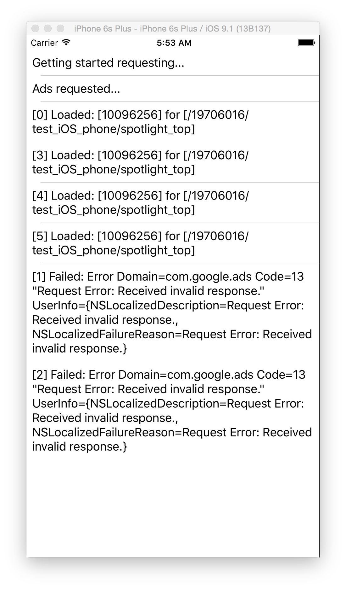

# GoogleNativeAdvertisingGlitch
Demonstration of Native Advertisement Issue

This sample code requests a small number of native ads (identifying them by index) and experiences "Invalid Response" errors. See original report here:

   https://productforums.google.com/forum/#%21msg/dfp/QbIqKOvL22Q/kRzaIMocGAAJ;context-place=forum/dfp

Output:

